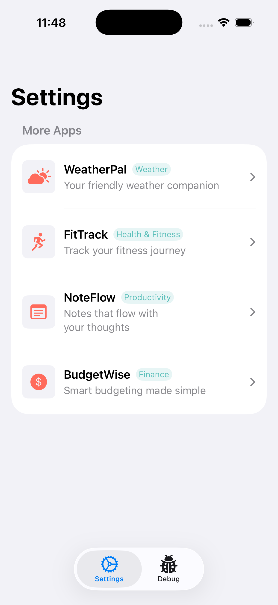

# CrossPromoKit

iOS 앱 포트폴리오 내 교차 프로모션을 위한 경량 Swift SDK입니다.

**언어**: [English](README.md) | [한국어](README.ko.md)

## 개요

CrossPromoKit은 원격 JSON 카탈로그를 사용하여 iOS 앱 간 원활한 교차 프로모션을 지원합니다. SKOverlay를 통한 네이티브 App Store 통합이 포함된 바로 사용 가능한 SwiftUI 뷰를 제공합니다.

## 주요 기능

- **SwiftUI 네이티브**: 설정 화면에 바로 삽입 가능한 `MoreAppsView` 컴포넌트
- **SKOverlay 통합**: 마찰 없는 앱 발견을 위한 인앱 App Store 오버레이
- **원격 구성**: GitHub, CDN 등 어디서나 호스팅 가능한 JSON 기반 앱 카탈로그
- **캐시 우선 로딩**: 24시간이 지나지 않은 캐시는 네트워크 요청 없이 그대로 사용하고, 네트워크 요청은 캐시 → 빈 상태로 폴백
- **분석 지원**: 노출 및 탭 이벤트를 위한 델리게이트 기반 이벤트 추적
- **프로모션 규칙**: 앱별 프로모션 대상을 제어하는 커스텀 규칙
- **다국어 지원**: 내장 UI 문자열 지역화(영어, 한국어, 일본어) 및 카탈로그 태그라인 지역화
- **Swift 6.0**: Sendable 타입으로 완전한 엄격 동시성 준수

## 데모

`Example/CrossPromoDemo` 디렉토리에 모든 기능을 보여주는 데모 앱이 포함되어 있습니다.

<p align="center">
  
</p>

데모 실행 방법:
1. `Example/CrossPromoDemo/CrossPromoDemo.xcodeproj` 열기
2. 시뮬레이터 선택 후 실행

데모에 포함된 기능:
- 샘플 앱이 포함된 MoreAppsView 실시간 미리보기
- UI 상태 컨트롤 (로드됨, 로딩 중, 빈 상태, 오류)
- 노출 및 탭 이벤트 로깅

## 요구 사항

- iOS 17.0+
- Swift 6.0+
- Xcode 16.0+

## 설치

### Swift Package Manager

SPM을 통해 CrossPromoKit을 프로젝트에 추가하세요:

```swift
dependencies: [
    .package(url: "https://github.com/yoonhg84/CrossPromoKit.git", branch: "main")
]
```

아직 태그된 릴리스가 없어 `from: "1.0.0"` 같은 버전 요구사항은 해석되지 않습니다.
지금은 브랜치(또는 `revision:`으로 특정 커밋)를 지정하세요. 버전 태그가 생기면
`.package(url: "https://github.com/yoonhg84/CrossPromoKit.git", from: "x.y.z")`로
바꾸면 됩니다.

또는 Xcode에서: File → Add Package Dependencies →
`https://github.com/yoonhg84/CrossPromoKit.git` 입력 후 **Branch** 규칙으로 `main`
선택.

## 빠른 시작

### 1. 앱 카탈로그 호스팅

JSON 파일을 생성하고 호스팅하세요 (예: GitHub raw URL):

```json
{
  "apps": [
    {
      "id": "myapp1",
      "name": "My App 1",
      "appStoreID": "123456789",
      "iconURL": "https://example.com/icon1.png",
      "category": "생산성",
      "tagline": {
        "en": "Your productivity companion",
        "ko": "당신의 생산성 동반자"
      }
    },
    {
      "id": "myapp2",
      "name": "My App 2",
      "appStoreID": "987654321",
      "iconURL": "https://example.com/icon2.png",
      "category": "금융",
      "tagline": {
        "en": "Manage your finances",
        "ko": "재정을 관리하세요"
      }
    }
  ]
}
```

### 2. 설정 화면에 추가

```swift
import SwiftUI
import CrossPromoKit

struct SettingsView: View {
    private let config = PromoConfig(
        jsonURL: URL(string: "https://your-domain.com/apps.json")!,
        currentAppID: "myapp1"
    )

    var body: some View {
        List {
            // 다른 설정 항목들...

            Section("더 많은 앱") {
                MoreAppsView(config: config)
            }
        }
    }
}
```

끝입니다! 현재 앱은 목록에서 자동으로 제외됩니다.

## 고급 사용법

### 분석 연동

델리게이트로 사용자 상호작용을 추적하세요:

```swift
class AnalyticsHandler: PromoEventDelegate {
    func promoService(_ service: PromoService, didEmit event: PromoEvent) {
        switch event {
        case .impression(let appID):
            // 분석 도구에 노출 이벤트 기록
            Analytics.log("promo_impression", ["app_id": appID])
        case .tap(let appID):
            // 분석 도구에 탭 이벤트 기록
            Analytics.log("promo_tap", ["app_id": appID])
        }
    }
}

// 사용법
let handler = AnalyticsHandler()
MoreAppsView(config: config, eventDelegate: handler)
```

> **핸들러를 직접 강하게 유지하세요.** `PromoService.eventDelegate`는 `weak`
> 참조이므로, 뷰 모델의 프로퍼티처럼 수명이 긴 곳에서 델리게이트를 붙잡고 있어야
> 합니다. 지역 변수로만 만든 핸들러는 스코프가 끝나는 순간 해제되고, 아무런 오류
> 없이 이벤트가 조용히 끊깁니다.

### 프로모션 규칙

어떤 앱이 어떤 앱을 프로모션할 수 있는지 제어하세요:

```json
{
  "apps": [...],
  "promoRules": {
    "myapp1": ["myapp2", "myapp3"],
    "myapp2": ["myapp1"]
  }
}
```

이 예시에서:
- `myapp1`은 `myapp2`와 `myapp3`만 표시
- `myapp2`는 `myapp1`만 표시
- 규칙이 없는 앱은 모든 다른 앱을 표시

## API 레퍼런스

### MoreAppsView

프로모션 앱을 표시하는 메인 SwiftUI 뷰입니다.

```swift
init(
    config: PromoConfig,
    eventDelegate: PromoEventDelegate? = nil,
    forceRefresh: Binding<Bool> = .constant(false)
)
```

```swift
// 기본 초기화
MoreAppsView(config: config)

// 분석 연동
MoreAppsView(config: config, eventDelegate: handler)

// 강제 새로고침 바인딩
MoreAppsView(config: config, forceRefresh: $isRefreshing)
MoreAppsView(config: config, eventDelegate: handler, forceRefresh: $isRefreshing)
```

### PromoConfig

프로모션 서비스 구성입니다.

```swift
struct PromoConfig {
    let jsonURL: URL        // 원격 JSON 엔드포인트
    let currentAppID: String // 앱의 ID (목록에서 제외됨)
}
```

### PromoService

앱 로딩과 상호작용을 관리하는 핵심 서비스입니다.

```swift
@Observable
class PromoService {
    var apps: [PromoApp]      // 현재 필터링된 앱 목록
    var isLoading: Bool       // 로딩 상태
    var error: Error?         // 오류 상태
    weak var eventDelegate: PromoEventDelegate? // 분석 델리게이트 (weak — 호출자가 유지)

    func loadApps() async     // 유효한 캐시 → 네트워크 → 만료된 캐시 순
    func forceRefresh() async // 항상 네트워크에서 다시 로드
    func handleAppTap(_ app: PromoApp)        // 오버레이 표시
    func handleAppImpression(_ app: PromoApp) // 노출 추적
    func dismissOverlay()     // 이 서비스가 띄운 App Store 오버레이 정리
}
```

`loadApps()`는 캐시를 먼저 봅니다. 캐시가 24시간을 넘기지 않았다면 그대로
사용하고 **네트워크 요청을 보내지 않으므로**, 프로모션 화면에 다시 들어와도
카탈로그를 매번 다시 받지 않습니다. 캐시가 없거나 만료됐을 때만 네트워크로
가며, 이때의 폴백은 기존과 같습니다. 요청이 실패하면 만료된 캐시라도 보여주고
(오프라인에서는 오래된 프로모션이 빈 목록보다 낫습니다), 캐시 데이터를 보여주는
동안 `error`는 항상 `nil`입니다. 캐시조차 없는 실패에서만 `error`가 설정되고 빈
상태가 표시됩니다.

`forceRefresh()`는 캐시를 우회하는 경로입니다. 만료되지 않은 캐시를 무시하고
항상 네트워크로 갑니다. 기존 캐시는 그대로 두어 요청이 실패하면 폴백으로 쓸 수
있고, 성공한 응답이 캐시를 덮어씁니다.

`dismissOverlay()`는 이 서비스가 표시 중인 SKOverlay를 정리합니다. 오버레이는
뷰가 아니라 윈도우 씬에 붙어 있어 프로모션 UI보다 오래 남을 수 있으므로,
`MoreAppsView`는 `onDisappear`에서 이 메서드를 호출합니다. 표시 중인 오버레이가
없으면 아무 일도 하지 않습니다.

### CacheManager

카탈로그 캐시입니다 (UserDefaults 기반, 24시간 만료).

```swift
actor CacheManager {
    init(scope: URL, userDefaults: UserDefaults = .standard)
    init(scopeIdentifier: String, userDefaults: UserDefaults = .standard)

    func expire()      // 데이터는 남기고 만료 표시만
    func clearCache()  // 데이터를 삭제
}
```

캐시 항목은 데이터를 가져온 **카탈로그 URL별로 분리**됩니다. 따라서 한 앱 안에서
서로 다른 `PromoConfig`를 써도 캐시가 서로 덮어쓰지 않습니다. `PromoService`는
기본적으로 `config.jsonURL`을 스코프로 하는 `CacheManager(scope:)`를 직접
만들며, 다른 네임스페이스나 별도의 `UserDefaults` 스위트가 필요할 때만 직접
전달하면 됩니다.

#### 캐시 무효화하기

다음 로드를 네트워크로 보내는 방법은 세 가지이며, **실패했을 때 무엇이 남는지**가
다릅니다.

| | 캐시 데이터 | 다음 로드 | 실패 시 폴백 |
|---|---|---|---|
| `CacheManager.clearCache()` | 삭제 | 네트워크 | 없음 — 빈 화면 |
| `CacheManager.expire()` | 유지 | 네트워크 | 오래된 데이터 |
| `PromoService.forceRefresh()` | 유지 | 네트워크 (1회) | 캐시 데이터 |

서버에서 카탈로그를 갱신하고 푸시로 알리는 경우에 필요한 것은 `expire()`입니다.
데이터는 오프라인 폴백으로 남지만 더 이상 최신으로 취급되지 않으므로, 다음
`loadApps()`가 캐시에서 끝나지 않고 실제로 fetch합니다. `forceRefresh()`는 캐시
상태를 바꾸지 않고 한 번만 우회하므로, 이후의 `loadApps()`는 다시 캐시로
응답됩니다.

```swift
let cache = CacheManager(scope: config.jsonURL)
await cache.expire()  // 다음 loadApps()는 fetch하고, 실패하면 기존 데이터가 남는다
```

### PromoEvent

서비스에서 발생하는 분석 이벤트입니다.

```swift
enum PromoEvent {
    case impression(appID: String) // 앱 행이 화면에 표시됨
    case tap(appID: String)        // 사용자가 행을 탭함
}
```

## JSON 형식

### 전체 스키마

```json
{
  "apps": [
    {
      "id": "string",           // 고유 식별자
      "name": "string",         // 표시 이름
      "appStoreID": "string",   // App Store 숫자 ID
      "iconURL": "string",      // 이미지 URL 또는 sf-symbol://<심볼 이름>
      "category": "string",     // 카테고리 라벨
      "tagline": {              // 지역화된 설명
        "en": "string",
        "ko": "string"
      }
    }
  ],
  "promoRules": {               // 선택 사항
    "appId": ["허용된", "앱", "ID들"]
  }
}
```

### 참고사항

- `iconURL`에는 원격 이미지 URL(HTTPS 권장, 일반 HTTP는 App Transport Security의
  제약을 받습니다) 또는 `sf-symbol://<심볼 이름>` URL을 넣을 수 있습니다. 예를
  들어 `"sf-symbol://cloud.sun.fill"`은 이미지를 내려받지 않고 해당 SF Symbol을
  로컬에서 그립니다. `sf-symbol://`이 아닌 값은 SwiftUI `AsyncImage`로 전달되며,
  이미지를 불러오지 못하면 플레이스홀더 아이콘으로 대체됩니다.
  `Example/CrossPromoDemo` 카탈로그가 SF Symbol 방식을 사용합니다.
- 카탈로그 URL(`PromoConfig.jsonURL`) 자체도 `https://`, `http://`, `file://`을
  지원하므로, 앱에 번들된 JSON 파일을 데모나 테스트에 그대로 쓸 수 있습니다.
- `tagline`은 사용자 로케일에 해당하는 값이 없으면 영어로 폴백됩니다
- 앱은 JSON 배열 순서대로 표시됩니다
- 현재 앱은 항상 자동으로 제외됩니다

## 다국어 지원

두 종류의 지역화가 서로 독립적으로 동작합니다:

- **카탈로그 콘텐츠**(`tagline`) — 직접 호스팅하는 JSON에서 제공하며, 언어 코드를
  키로 사용합니다. `en`은 필수이고 `ko`, `ja`는 선택이며, 기기 로케일에 해당하는
  값이 없으면 영어로 폴백됩니다. `category`는 지역화 대상이 아니라 JSON에 적은
  문자열이 그대로 표시되므로, 언어별로 다르게 보여주려면 카탈로그 자체를 분리해야
  합니다.
- **내장 UI 문자열**(빈 상태 문구, 다시 시도/취소 버튼, App Store 오버레이 오류
  알림, VoiceOver 레이블) — 패키지 안에 String Catalog
  (`Sources/CrossPromoKit/Resources/Localizable.xcstrings`)로 포함되어 있어 호스트
  앱의 번들 설정과 무관하게 지역화됩니다.

기본 제공 UI 언어: 영어(소스), 한국어, 일본어. 그 외 로케일은 영어로 폴백됩니다.

언어를 추가하려면 Xcode에서 `Localizable.xcstrings`를 열어 로케일을 추가하고 항목을
번역하면 됩니다. 코드 변경은 필요 없습니다.

## 라이선스

MIT 라이선스 - 자세한 내용은 [LICENSE](LICENSE)를 참조하세요.

---

iOS 개발자 커뮤니티를 위해 정성껏 만들었습니다.
