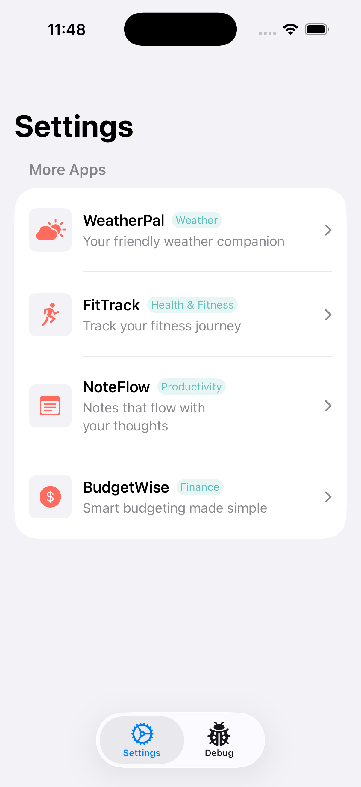

# CrossPromoKit

A lightweight Swift SDK for cross-promoting your iOS apps within your app portfolio.

**Language**: [English](README.md) | [한국어](README.ko.md)

## Overview

CrossPromoKit enables seamless cross-promotion between your iOS apps using a remote JSON catalog. It provides a ready-to-use SwiftUI view that displays your other apps with native App Store integration via SKOverlay.

## Features

- **SwiftUI Native**: Drop-in `MoreAppsView` component for your settings screen
- **SKOverlay Integration**: In-app App Store overlay for frictionless discovery
- **Remote Configuration**: JSON-based app catalog hosted anywhere (GitHub, CDN, etc.)
- **Three-Tier Fallback**: Network → Cache → Empty State for reliability
- **Analytics Ready**: Delegate-based event tracking for impressions and taps
- **Promo Rules**: Control which apps promote which with customizable rules
- **Localization**: Built-in support for localized taglines
- **Swift 6.0**: Full strict concurrency compliance with Sendable types

## Demo

A demo app is included in the `Example/CrossPromoDemo` directory to showcase all features.

<p align="center">
  
</p>

To run the demo:
1. Open `Example/CrossPromoDemo/CrossPromoDemo.xcodeproj`
2. Select a simulator and run

The demo includes:
- Live preview of MoreAppsView with sample apps
- UI state controls (loaded, loading, empty, error)
- Event logging for impressions and taps

## Requirements

- iOS 17.0+
- Swift 6.0+
- Xcode 16.0+

## Installation

### Swift Package Manager

Add CrossPromoKit to your project via SPM:

```swift
dependencies: [
    .package(url: "https://github.com/user/CrossPromoKit.git", from: "1.0.0")
]
```

Or in Xcode: File → Add Package Dependencies → Enter the repository URL.

## Quick Start

### 1. Host Your App Catalog

Create a JSON file and host it (e.g., GitHub raw URL):

```json
{
  "apps": [
    {
      "id": "myapp1",
      "name": "My App 1",
      "appStoreID": "123456789",
      "iconURL": "https://example.com/icon1.png",
      "category": "Productivity",
      "tagline": {
        "en": "Your productivity companion",
        "ko": "당신의 생산성 동반자"
      }
    },
    {
      "id": "myapp2",
      "name": "My App 2",
      "appStoreID": "987654321",
      "iconURL": "https://example.com/icon2.png",
      "category": "Finance",
      "tagline": {
        "en": "Manage your finances",
        "ko": "재정을 관리하세요"
      }
    }
  ]
}
```

### 2. Add to Your Settings Screen

```swift
import SwiftUI
import CrossPromoKit

struct SettingsView: View {
    var body: some View {
        List {
            // Your other settings...

            Section("More Apps") {
                MoreAppsView(currentAppID: "myapp1")
            }
        }
    }
}
```

That's it! The current app is automatically excluded from the list.

## Advanced Usage

### Custom Configuration

```swift
import CrossPromoKit

let config = PromoConfig(
    jsonURL: URL(string: "https://your-domain.com/apps.json")!,
    currentAppID: "myapp1"
)

MoreAppsView(config: config)
```

### Analytics Integration

Track user interactions with the delegate:

```swift
class AnalyticsHandler: PromoEventDelegate {
    func promoService(_ service: PromoService, didEmit event: PromoEvent) {
        switch event {
        case .impression(let appID):
            // Track impression in your analytics
            Analytics.log("promo_impression", ["app_id": appID])
        case .tap(let appID):
            // Track tap in your analytics
            Analytics.log("promo_tap", ["app_id": appID])
        }
    }
}

// Usage
let handler = AnalyticsHandler()
MoreAppsView(config: config, eventDelegate: handler)
```

### Promo Rules

Control which apps can promote which apps:

```json
{
  "apps": [...],
  "promoRules": {
    "myapp1": ["myapp2", "myapp3"],
    "myapp2": ["myapp1"]
  }
}
```

In this example:
- `myapp1` will only show `myapp2` and `myapp3`
- `myapp2` will only show `myapp1`
- Apps without rules show all other apps

## API Reference

### MoreAppsView

The main SwiftUI view for displaying promotable apps.

```swift
// Simple initialization
MoreAppsView(currentAppID: String)

// With custom config
MoreAppsView(config: PromoConfig)

// With analytics
MoreAppsView(config: PromoConfig, eventDelegate: PromoEventDelegate?)
```

### PromoConfig

Configuration for the promotion service.

```swift
struct PromoConfig {
    let jsonURL: URL        // Remote JSON endpoint
    let currentAppID: String // Your app's ID (excluded from list)
}
```

### PromoService

The core service managing app loading and interactions.

```swift
@Observable
class PromoService {
    var apps: [PromoApp]      // Current filtered apps
    var isLoading: Bool       // Loading state
    var error: Error?         // Error state

    func loadApps() async     // Load with fallback
    func forceRefresh() async // Bypass cache
    func handleAppTap(_ app: PromoApp)       // Trigger overlay
    func handleAppImpression(_ app: PromoApp) // Track impression
}
```

### PromoEvent

Analytics events emitted by the service.

```swift
enum PromoEvent {
    case impression(appID: String) // App row appeared
    case tap(appID: String)        // User tapped row
}
```

## JSON Format

### Full Schema

```json
{
  "apps": [
    {
      "id": "string",           // Unique identifier
      "name": "string",         // Display name
      "appStoreID": "string",   // App Store numeric ID
      "iconURL": "string",      // HTTPS URL to icon
      "category": "string",     // Category label
      "tagline": {              // Localized descriptions
        "en": "string",
        "ko": "string"
      }
    }
  ],
  "promoRules": {               // Optional
    "appId": ["allowed", "app", "ids"]
  }
}
```

### Notes

- `iconURL` must be HTTPS
- `tagline` falls back to English if user's locale isn't available
- Apps are displayed in JSON array order
- The current app is always excluded automatically

## License

MIT License - see [LICENSE](LICENSE) for details.

---

Made with care for the iOS developer community.
